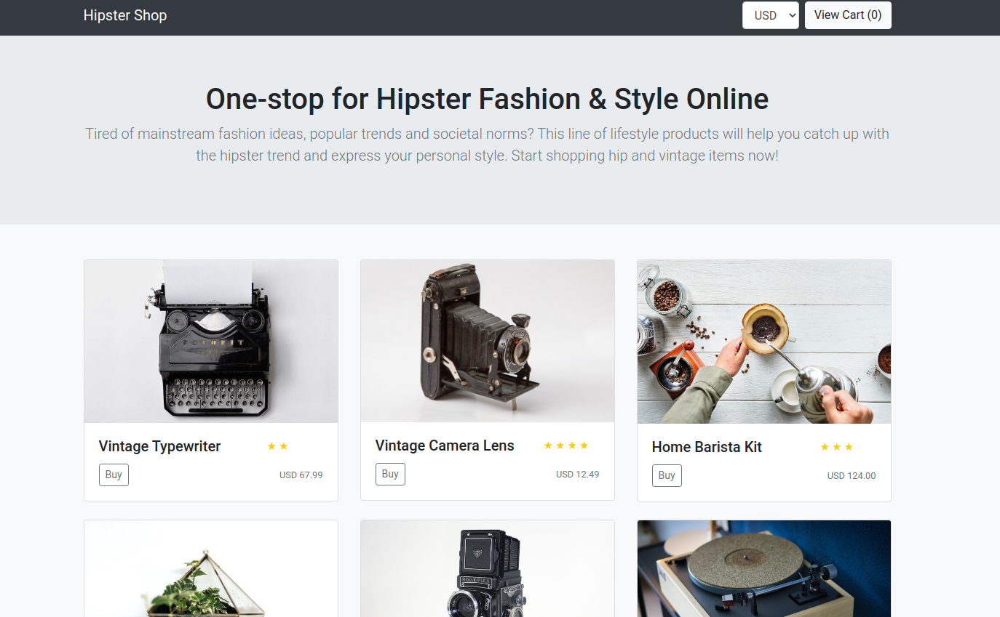
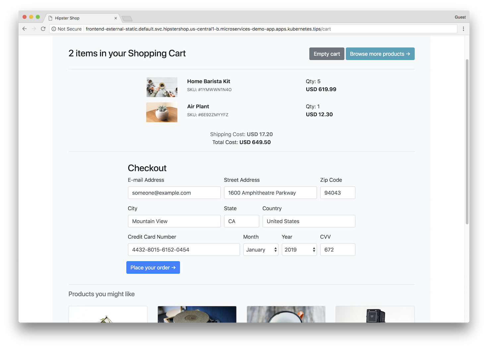

# Cloud Operations Sandbox (Alpha)


Cloud Operations Sandbox is an open-source tool that helps practitioners to learn Service Reliability Engineering practices from Google and apply them on their cloud services using [Cloud Operations](https://cloud.google.com/products/operations) (formerly Stackdriver).
It is based on [Hipster Shop](https://github.com/GoogleCloudPlatform/microservices-demo), a cloud-native microservices application.

Sandbox offers:

* **Demo Service** - an application built using microservices architecture on modern, cloud-native stack.
* **One-click deployment**  - a script handles the work of deploying the service to Google Cloud Platform.
* **Load Generator** - a component that produces synthetic traffic on a demo service.
* (Soon) **SRE Runbook** - pre-built routine procedures for operating the deployed sample service that follow best SRE practices using Cloud Operations.

## Why Sandbox

Google Cloud Cloud Operations is a suite of tools that helps you gain full observability of your code and applications.
You might want to take Cloud Operations to a "test drive" in order to answer the question, "will it work for my application needs"?
The most effective way to learn is by testing the tool in "real-life" conditions, but without risking a production system.
With Sandbox, we provide a tool that automatically provisions a new demo cluster, which receives traffic, simulating real users. Practitioners can experiment with various Cloud Operations tools to solve problems and accomplish standard SRE tasks in a sandboxed environment.

## Getting Started

* Using Sandbox
  * [Prerequisites](#Prerequisites)
  * [Set Up](#Set-Up)
  * [Next Steps](#Next-Steps)
  * [Clean Up](#Clean-Up)
* [Service Overview](#Service-Overview)
  * [Screenshots](#Screenshots)
  * [Architecture](#Service-Architecture)

## Using Sandbox

### Prerequisites

* Create and enable [Cloud Billing Account](https://cloud.google.com/billing/docs/how-to/manage-billing-account).

### Set Up

Click the Cloud Shell button for automated one-click installation of a new Sandbox cluster in a new Google Cloud Project.

[](https://console.cloud.google.com/cloudshell/editor?cloudshell_git_repo=https://github.com/GoogleCloudPlatform/cloud-ops-sandbox.git&cloudshell_git_branch=v0.6.0&shellonly=true&cloudshell_image=gcr.io/stackdriver-sandbox-230822/cloudshell-image/uncertified:v0.6.0&cloudshell_tutorial=docs/tutorial.md)

__Note__: If installation stops due to billing account errors, set up the billing account and type: `sandboxctl create`.

### Next Steps

* Explore your Sandbox deployment and its [architecture](#Service-Overview)
* Follow the User Guide to start using [Cloud Operations](https://cloud-ops-sandbox.dev/docs/user-guide/learn-cloud-operations/)
* Learn more about Cloud Operations using [Code Labs](https://codelabs.developers.google.com/s/results?q=Monitoring)

### Clean Up

When you are done using Cloud Operations Sandbox, you can tear down the environment by deleting the GCP project that was set up for you. This can be accomplished in any of the following ways:

* Use the `sandboxctl` script:

```bash
sandboxctl destroy
```

* If you no longer have the Cloud Operations Sandbox files downloaded, delete your project manually using `gcloud`

```bash
gcloud projects delete $YOUR_PROJECT_ID
```

* Delete your project through Google Cloud Console's [Resource Manager web interface](https://console.cloud.google.com/cloud-resource-manager)

## Service Overview

This project contains a multi-tier microservices application.
It is a web-based e-commerce app called **“Hipster Shop”**, where users can browse items, add them to the cart, and purchase them.

### Screenshots

| Home Page | Checkout Screen |
|-----------|-----------------|
| [](./docs/img/hipster-shop-frontend-1.png) | [](./docs/img/hipster-shop-frontend-2.png) |

### Service Architecture

**Hipster Shop** is composed of many microservices, written in different languages, that talk to each other over gRPC and REST API.
>**We are not endorsing the architecture of Hipster Shop as the best way to build such a shop!**
> The architecture is optimized for learning purposes and includes modern stack: Kubernetes, GKE, Istio,
> Cloud Operations, App Engine, gRPC, OpenTelemetry, and similar cloud-native technologies.

[](./docs/img/architecture-diagram.png)

Find the **gRPC protocol buffer descriptions** in the [`./pb` directory](./pb).

| Service | Language | Description |
|---------|----------|-------------|
| [frontend](./src/frontend) | Go | Exposes an HTTP server to serve the website. Does not require signup/login, and generates session IDs for all users automatically. |
| [cartservice](./src/cartservice) |  C# | Manages the items in the user's shipping cart by using Redis. |
| [productcatalogservice](./src/productcatalogservice) | Go | Provides the list of products from a JSON file and the ability to search and retrieve products. |
| [currencyservice](./src/currencyservice) | Node.js | Converts one currency to another, using real values fetched from  the European Central Bank. It's the highest QPS service. |
| [paymentservice](./src/paymentservice) | Node.js | Charges the given credit card info (hypothetically😇) with the given amount and returns a transaction ID. |
| [shippingservice](./src/shippingservice) | Go | Gives shipping-cost estimates based on the shopping cart. Ships items to the given address (hypothetically😇). |
| [emailservice](./src/emailservice) | Python | Sends users an order-confirmation email (hypothetically😇). |
| [checkoutservice](./src/checkoutservice) | Go | Retrieves a user's cart, prepares the order, and orchestrates payment, shipping, and email notification. |
| [recommendationservice](./src/recommendationservice) | Python | Recommends other products based on what's in the user's cart. |
| [adservice](./src/adservice) | Java | Provides text ads based on given context words. |
| [loadgenerator](./src/loadgenerator) | Python/Locust | Continuously sends requests that imitate realistic shopping flows to the frontend. |
| [ratingservice](./src/ratingservice) | Python3 | Manages ratings of the shop's products. Runs on App Engine. |

### Technologies

* **[Kubernetes](https://kubernetes.io)/[GKE](https://cloud.google.com/kubernetes-engine/):**
  The app is designed to run on Google Kubernetes Engine.
* **[gRPC](https://grpc.io):** Microservices use a high volume of gRPC calls to
  communicate to each other.
* **[OpenTelemetry](https://opentelemetry.io/) Tracing:** Most services are
  instrumented using OpenTelemetry tracers and interceptors which handle trace context propagation through gRPC and HTTP.
* **[Cloud Operations APM and SRE](https://cloud.google.com/products/operations):** Many services
  are instrumented with **Profiling**, **Tracing**, **Debugging**, **Monitoring**, **Logging** and **Error Reporting**.
* **[Skaffold](https://github.com/GoogleContainerTools/skaffold):** A tool used for doing repeatable deployments. You can deploy to Kubernetes with a single command using Skaffold.
* **Synthetic Load Generation:** The application demo comes with dedicated load generation service that creates realistic usage patterns on Hipster Shop website using
  [Locust](https://locust.io/) load generator.
* **[Google App Engine](https://cloud.google.com/appengine):** PaaS for running Web applications and services.
* **[Google Cloud SQL](https://cloud.google.com/sql):** Fully managed relational database service for MySQL, PostgreSQL and SQL Server.

## For Developers

If you are a developer and want to contribute to the Sandbox, you can refer to [CONTIBUTING.md](CONTRIBUTING.md).

---

This is not an official Google project.
