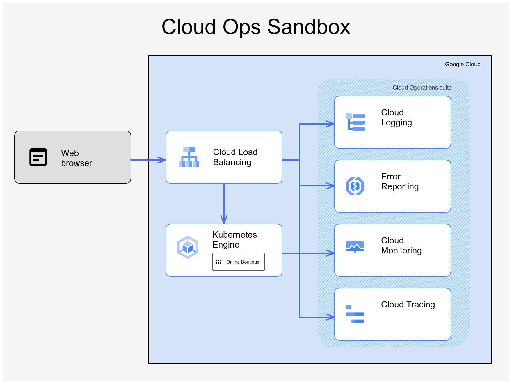

# Cloud Operations (Ops) Sandbox User Guide

## Overview

Cloud Ops Sandbox (**Sandbox** further in this document) lets you to trial
various services and instruments in the Google [Cloud Operations
suite][cloud-ops] of services by using a non-trivial microservice application
deployed on Kubernetes like [Online Boutique][ob].
With Sandbox you can experiment with existing tools to troubleshoot operational
problems in a sandboxed environment or to have hands-on experience with
creating new observability instruments.

## Architecture of Cloud Ops Sandbox

Sandbox is composed of two main components: a demo application and
observability instruments.



Online Boutique was selected to be a demo application because its microservice
architecture, multi-language implementation and support of Clound Native
deployment. You can look into its architecture [here][ob-architecture].
You also can look into its code to explore techniques used to instrument
its services with application metrics and tracing features.

Sandbox configures Cloud Operations suite to display observability data ingested
by the Online Boutique services using OpenTelemetry instrumentation.
The configuration is adapted to show an opinionated approach to monitor
application's reliability state with:

* [Logs][log-explorer]
* [Uptime checks][uptime-checks]
* [Monitoring dashboards][custom-dashboards]
* [Service SLOs][slo-services]

> **Note**
> If one of the above links does not show data you expect, [select project][1]
that hosts your Sandbox in Cloud Console.

## Customize Launch

You can launch Sandbox using Cloud Shell button below and following walkthrough
instructions:

[][2]

Or, by executing the following commands in your local environment:

```terminal
git clone https://github.com/GoogleCloudPlatform/cloud-ops-sandbox
gcloud auth application-default loging
cloud-ops-sandbox/provisioning/sandboxctl -p PROJECT_ID
```

where `PROJECT_ID` identifies the Google Cloud project where you want to
launch Cloud Ops Sandbox.

The `-p` or `--project-id` parameter is required in order to define where Cloud
Ops Sandbox will be launched. If no value is provided, `sandboxctl` will try
to use the configuration of gcloud CLI.

Additionally, you can customize other parameters of the launching process.
Sandbox CLI(`cloud-ops-sandbox/provisioning/sandboxctl`) supports the following
options:

* _Disable Load Generator_ -- By default, the launch will provision an instance
of [Locust](https://locust.io/) load generator that will emulate some load on
the Online Boutique application. Add `--skip-loadgenerator` parameter to cancel
provisioning of the load generator.
* _Do not use Anthos Service Mesh (ASM)_ -- By default, ASM is provisioned to
manage all inter-service communication between Online Boutique services as well
as ingress traffic to the Online Boutique frontend service. Add `--skip-asm`
parameter to not provision ASM.
**NOTE:** If you do not install ASM, you would not be able to experiment with
[Service SLOs][slo-services]
* _Custom GKE cluster name_ -- By default, the launch provisions a new GKE
cluster with the name "cloud-ops-sandbox". Use `--cluster-name` or `-n`
parameter following by the custom cluster name to change the default
behavior. For example, `--cluster-name another-sandbox` will launch Sandbox
with GKE cluster named "another-sandbox".
* _Customer GKE cluster location_ -- The default location for GKE cluster is
in the "us-central1" region. If you like to launch Sandbox's GKE cluster in
another region or launch it in a specific zone, use `--cluster-location`
or `-l` parameter. For example, `--cluster-location europe-west2-a` will
launch Sandbox's GKE cluster in zone A of the London's region (europe-west2).
* _Verbose output_ -- By default, CLI tries to minimize output printed to
console. Add `-v` or `--verbose` parameter to have more detailed output.
* To print usage help just run `sandboxctl` or use `-h` parameter.
* To check the version of Sandbox CLI use `--version` parameter.

### Launching Recommendations

Use the walkthrough to launch Cloud Ops Sandbox. The walkthrough assist
you in every step and provides extra explanations while still allowing
you to customize launch parameters.
While it is possible to share GCP resources between Sandbox and your other
workloads, it is recommended to launch Sandbox in the designated
project.
Note that reusing existing GKE cluster to launch Sandbox is not supported.

To minimize launch time and reduce operational costs it is recommended to
configure zonal location for Sandbox's GKE cluster.

## Explore Sandbox

You can review resources deployed by Online Boutique in the GKE screen of Google
Cloud console by [opening the screen][gke] in your browser and selecting
**Workloads** from the left-side bar menu to see deployments:


You can open the application's Web UI and play with the application. To do it
copy/paste URL that the launch script printed at the end, similar to:

```terminal
********************************************************************************
Cloud Operations Sandbox deployed successfully!

     Google Cloud Console GKE Dashboard: https://console.cloud.google.com/kubernetes/workload
     Google Cloud Console Monitoring Workspace: https://console.cloud.google.com/monitoring
     Try Online Boutique at http://34.12.46.8

********************************************************************************
```

Or you can search for URL by selecting **Services** from the left-side
bar menu and looking for services that expose public URLs and selecting one
that points to port 80. Learn more about Online Boutique in its [documentation][ob-screens].

Go to [Cloud Ops artifacts that Sandbox provisions](cloud-ops.md) to learn more
about other Sandbox resources.

SRE recipes are currently 🚧 under construction and not available.
You can try the previous version of the recipes by deploying Cloud Ops Sandbox
v0.8.2 at [cloud-ops-sandbox.dev](https://cloud-ops-sandbox.dev/).

## How much it costs

The cost of resources used by Sandbox is composed of the cost of:

* [GKE cluster][gke_pricing]
* [ASM][asm_pricing] if enabled

You will most probably fit the free tier for using services in [Cloud Operating
suite][ops_pricing].
GKE cluster is the core part of the bill. You can see [estimate] costs with
pricing [calculator].

[1]: https://cloud.google.com/resource-manager/docs/creating-managing-projects#console_1
[2]: https://console.cloud.google.com/?cloudshell_git_repo=https%3A%2F%2Fgithub.com%2Fgooglecloudplatform%2Fcloud-ops-sandbox&cloudshell_git_branch=0.9.1&cloudshell_tutorial=docs/walkthrough.md
[cloud-ops]: <http://cloud.google.com/products/operations
[ob]: <https://github.com/GoogleCloudPlatform/microservices-demo
[ob-architecture]: <https://github.com/GoogleCloudPlatform/microservices-demo#architecture
[ob-screens]: <https://github.com/GoogleCloudPlatform/microservices-demo#screenshots
[log-explorer]: <https://pantheon.corp.google.com/logs/query
[uptime-checks]: <https://pantheon.corp.google.com/monitoring/uptime
[custom-dashboards]: https://console.cloud.google.com/monitoring/dashboards?pageState=("dashboards":("t":"Custom"))
[slo-services]: https://console.cloud.google.com/monitoring/services
[gke_pricing]: https://cloud.google.com/gke/pricing
[asm_pricing]: https://cloud.google.com/service-mesh/pricing
[ops_pricing]: https://cloud.google.com/stackdriver/pricing
[estimate]: https://cloud.google.com/stackdriver/estimating-bills
[calculator]: <https://cloud.google.com/products/calculator>
[gke]: https://console.cloud.google.com/kubernetes/
