# Cloud Operations Sandbox User Guide

# Overview

The Cloud Operations Sandbox is intended to make it easy for you to deploy and run a non-trivial application that lets you explore the Google Cloud Platform services, particularly the [Ops Management](http://cloud.google.com/products/operations) (formerly Stackdriver) product suite. Ops Management is a suite of tools that helps you gain full observability into your code and applications.

The Hipster Shop application used in the sandbox is intended to be sufficiently complex such that you can meaningfully experiment with it, and the Sandbox automatically provisions a new demo cluster, configures and deploys Hipster Shop, and simulates real users.

With the Sandbox running, you can experiment with various Ops Management tools to solve problems and accomplish standard SRE tasks in a sandboxed environment without impacting your production monitoring setup.

## Architecture of the Hipster Shop application

The Hipster Shop application consists of a number of microservices, written in a variety of languages, that talk to each other over gRPC.


**Note:** We are not endorsing this architecture as the best way to build a real online store. This application is optimized for demonstration and learning purposes.  It illustrates a large number of cloud-native technologies, uses a variety of programming languages, and provides an environment that can be explored productively with Ops Management tools.

The Git repository you cloned has all the source code, so you can explore the implementation details of the application. See the repository [README](https://github.com/GoogleCloudPlatform/cloud-ops-sandbox) for a guided tour.

# Prerequisites

You must have an active Google Cloud Platform Billing Account. If you already have one, you can skip this section.

Otherwise, to create a GCP Billing Account, do the following:

1. Go to the Google Cloud Platform [Console](https://console.cloud.google.com/) and sign in (if you have an account), or sign up (if you don't have an account).
1. Select **Billing** from the navigation panel and follow the instructions.

For more information, see ["Create a new billing account"](https://cloud.google.com/billing/docs/how-to/manage-billing-account).

# Set up

## Deploy the Sandbox

In a new browser tab, navigate to the Cloud Operations Sandbox [website](https://stackdriver-sandbox.dev/) and follow the instructions there:

Click the **Open in Google Cloud Shell** button. You might have to click Proceed on a second dialog if you haven't run Cloud Shell before.

Additionally, there will be a window that opens asking whether you trust the custom container. Check the "Trust" box in order to authenticate.

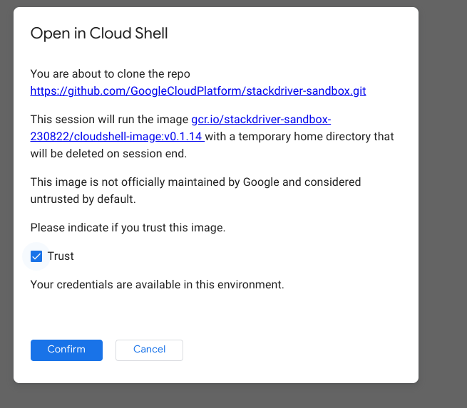

After the shell starts, the Cloud Operations Sandbox repository is cloned to your shell container, and you are placed in the `cloud-ops-sandbox/terraform` directory. The installer script should start running automatically.

The installer script performs the following tasks:

-  Enables the necessary GCP features
-  Creates a GCP project named "Cloud Operations Sandbox Demo"
-  Creates and configures a GKE cluster and deploys the microservices that make up the Hipster Shop application
-  Starts a Compute Engine instance and runs [Locust](https://locust.io/), a load-generator application

The installation process takes a few minutes. When it completes, you see a message like the following:

```bash
********************************************************************************
Cloud Operations Sandbox deployed successfully!

     Google Cloud Console GKE Dashboard: https://console.cloud.google.com/kubernetes/workload?project=<project ID>
     Google Cloud Console Monitoring Workspace: https://console.cloud.google.com/monitoring?project=<project ID>
     Hipstershop web app address: http://XX.XX.XX.XX
     Load generator web interface: http://XX.XX.XX.XX
```

The URLs in this message tell you where to find the results of the installation:

> A Workspace will be created automatically for your project if you don't have one already, so you don't have to do anything explicitly with this URL.

-  The **Google Cloud Console GKE Dashboard** URL takes you to the Kubernetes Engine console for your deployment.

- The **Google Cloud Console Monitoring Workspace** URL takes you to the Cloud Monitoring console for your deployment.

-  The **Hipster Shop** URL takes you to the storefront.

-  The **load generator** URL takes you to an interface for generating synthetic traffic to Hipster Shop.

## Explore your project in GCP

In another browser tab, navigate to the GCP GKE Dashboard URL, which takes you to the Kubernetes Engine ([documentation](https://cloud.google.com/kubernetes-engine/docs/)) **Workloads** page for the project created by the installer:

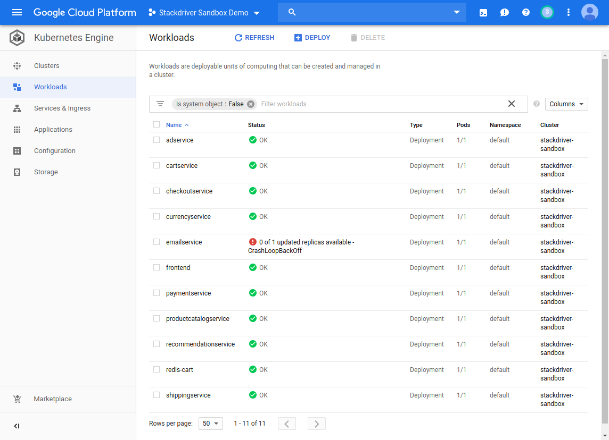

## Explore Cloud Monitoring

In a new browser tab, navigate to the GCP Monitoring Workspace URL, which takes you to the Cloud Monitoring ([documentation](https://cloud.google.com/monitoring)) **Workspace** page for your new project. The console may take some time to create a new workspace. Afterward, you'll be able to see a few dashboards generated through Ops Management tools.


## Shop like a hipster!

In a new browser tab, navigate to the Hipster Shop URL, where you can "purchase" everything you need for your hipster lifestyle using a mock credit card number:

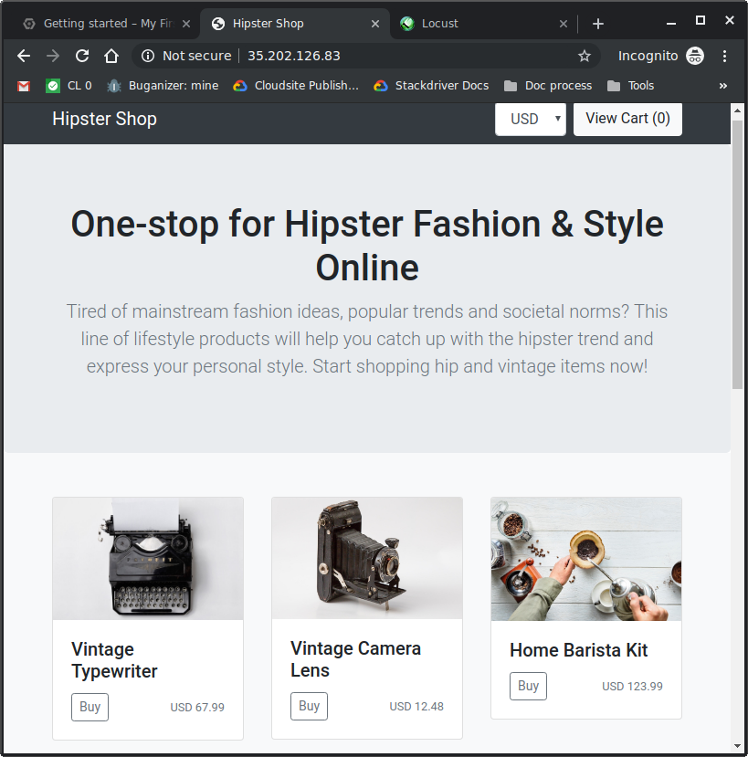

## Run the load generator

In another browser tab, navigate to the load-generator URL, from which you can simulate users interacting with the application to generate traffic. For this application, values like 100 users with a "hatch rate" of 2 (spawn 2 users per second) are reasonable.

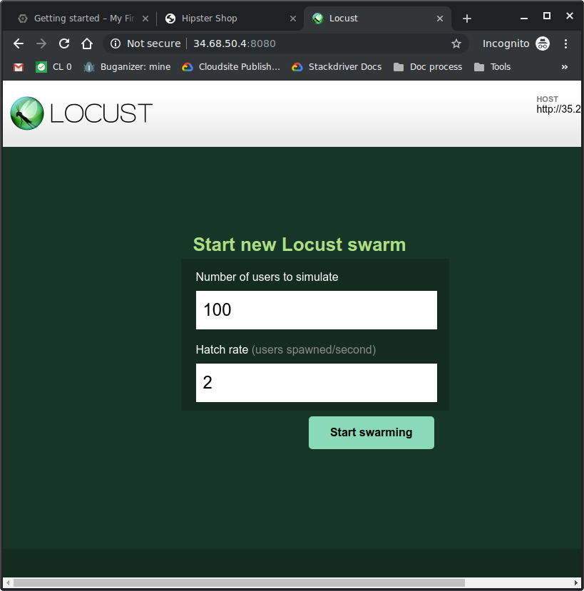

From here, you can explore how the application was deployed, and you can use the  
navigation menu to bring up other GCP tools.

# Learn Ops Management

## Ops Management Overview

As the cloud-native microservice architecture, which promises scalability and flexibility benefits, gets more popular, developers and administrators need tools that can work across cloud-based distributed systems.

Ops Management provides products for both developers and administrators; this section introduces the products and their general audiences.  The tools are covered in more detail later.

Application developers need to be able to investigate the cause of problems in applications running in distributed environments, and in this context, the importance of **Application Performance Management (APM)** has increased. Ops Management provides 3 products for APM:

-  Cloud Trace
-  Cloud Profiler
-  Cloud Debugger

Similarly, cloud-native, microservice-based applications complicate traditional approaches used by administrators for monitoring system health: it's harder to observe your system health when the number of instances is flexible and the inter-dependencies among the many components are complicated. In the last few years, **Site Reliability Engineering (SRE)** has become recognized as a practical approach to managing large-scale, highly complex, distributed systems. Ops Management provides the following tools that are useful for SRE:

-  Cloud Monitoring
-  Cloud Logging
-  Cloud Error Reporting

You can find the Ops Management products in the navigation panel on the GCP Console:


## The Cloud Operations APM products: Trace, Profiler, and Debugger

### Cloud Trace

#### Trace Overview

Cloud Trace ([documentation](https://cloud.google.com/trace/docs/)) enables developers to see distributed traces that visually expose latency bottleneck in requests. Developers instrument application code to collect trace information. You can also include environmental information in traces and trace information can be included in Cloud Logging logs. The Trace UI can then pull relevant log events into the trace timelines. 

For instrumenting your applications, currently recommended solution is **OpenCensus.** [OpenCensus](https://opencensus.io/) is an open-source project that supports trace instrumentation in a variety of languages and that can export this data to Cloud Operations. Then you can use the Cloud Trace UI to analyze the data. Note that OpenCensus is merging with another similar project, OpenTracing, to form OpenTelemetry. See **OpenCensus to become OpenTelemetry**  in this doc.

HipsterShop microservices are instrumented to collect trace data. In addition to distributed tracing, **OpenCensus (Stats)** provides the sink to send quantifiable data, such as database latency, open file descriptors, and so on, that helps to set up monitoring of [SLIs and SLOs](https://cloud.google.com/blog/products/gcp/sre-fundamentals-slis-slas-and-slos) for the service. This data is available in Cloud Monitoring, and HipsterShop microservices are also instrumented to collect this kind of data.

#### Using Trace

To bring up Cloud Trace, click **Trace** in the GCP navigation panel. This takes you to the Trace **Overview** page, where you see the traces generated by the Sandbox microservices:


Click **Trace List** in the navigation panel to get the list of traces captured during a particular time:

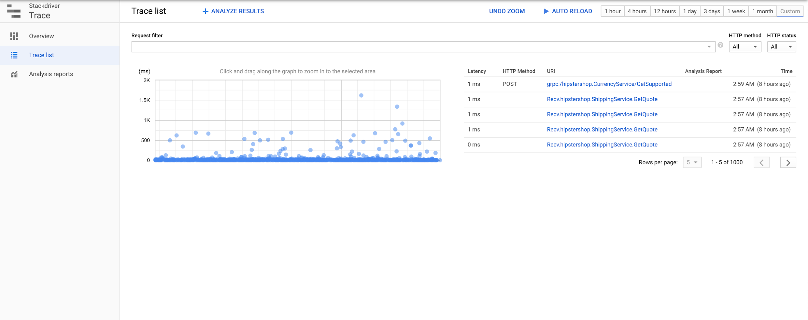

Click on any trace in the timeline to get a detailed view and breakdown of the traced call and the subsequent calls that were made:

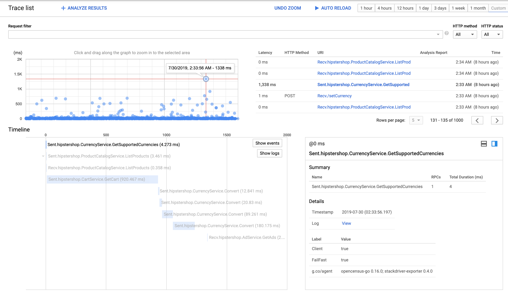

Finally, click **Analysis Reports** in the navigation menu to see a list of reports that are generated.

If you have just set up the Sandbox environment, you may not have any reports. Click on **New Report** to create one. An example of a first report: in the Request Filter field, select **Recv./cart**. Leave the other options the default. Once the report is created, you should be able to see it in the **Analysis Reports** list.

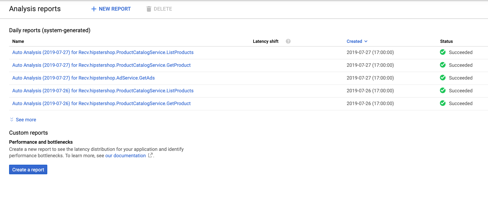

View one of the reports that was created (or the one you created yourself) to understand either the density or cumulative distribution of latency for the call you selected:

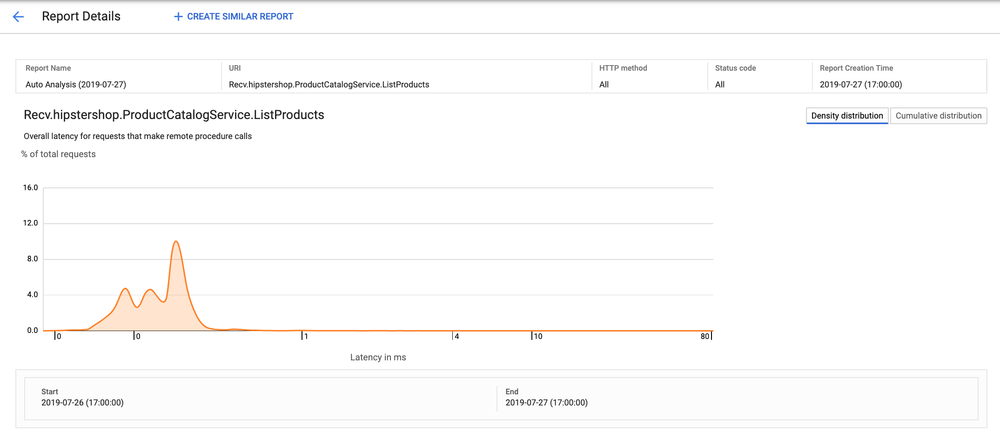

Feel free to explore the tracing data collected from here before moving on to the next section.

### Cloud Profiler

#### Profiler Overview

Cloud Profiler ([documentation](https://cloud.google.com/profiler/docs/)) performs statistical sampling on your running application. Depending on the language, it can capture statistical data on CPU utilization, heap size, threads, and so on. You can use the charts created by the Profiler UI to help identify performance bottlenecks in your application code. 

You do not have to write any profiling code in your application; you simply need to make the Profiler library available (the mechanism varies by language). This library will sample performance traits and create reports, which you can then analyze with the Profiler UI.

The following Hipster Shop microservices are configured to capture profiling data:

-  Checkout service
-  Currency service
-  Frontend
-  Payment service
-  Product-catalog service
-  Shipping service

#### Using Profiler

Select **Profiler** from the GCP navigation menu to open the Profiler home page. It comes up with a default configuration and shows you the profiling graph:

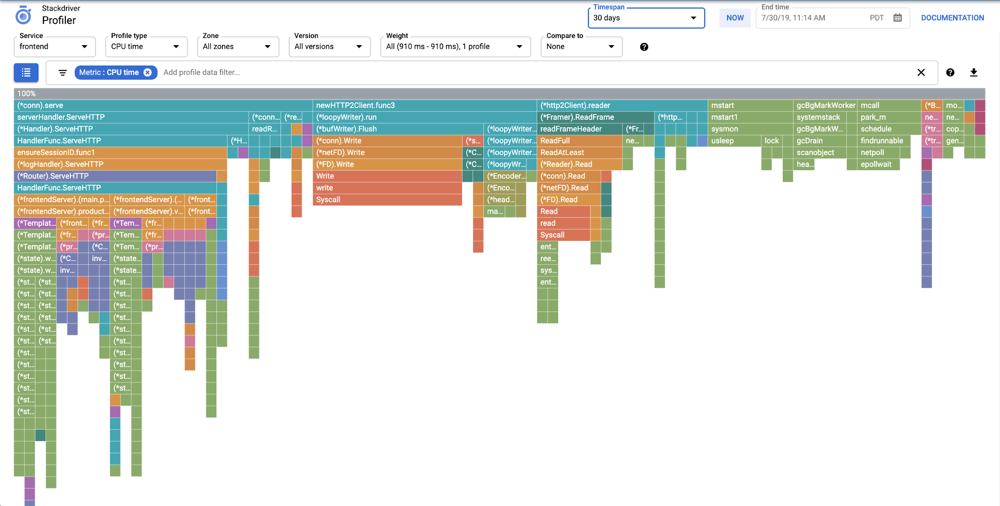

You can change the service, the profile type, and many other aspects of the configuration For example, to select the service you'd like to view Profiler data for, choose a different entry on the **Service** pulldown menu:

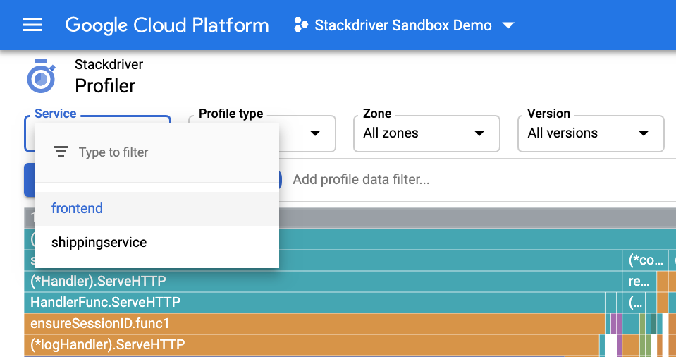

Depending on the service you select and the language it's written in, you can select from multiple metrics collected by Profiler:

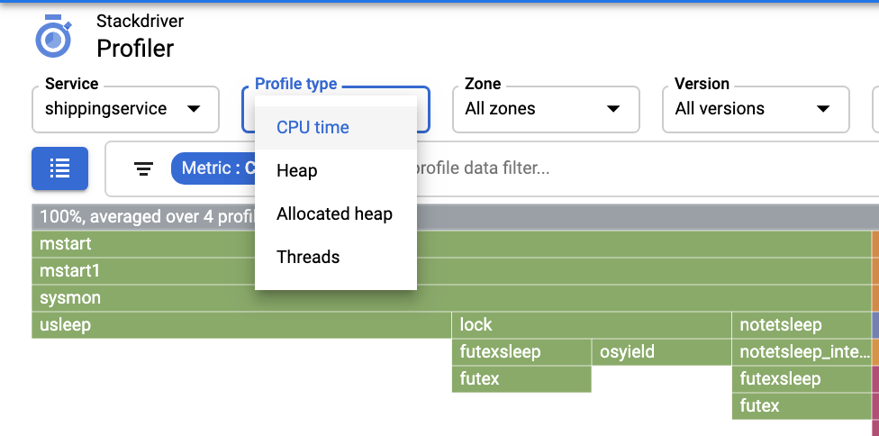

> See ["Types of profiling available"](https://cloud.google.com/profiler/docs/concepts-profiling#types_of_profiling_available) for information on the specific metrics available for each language.

Profiler uses a visualization called a flame graph to represents both code execution and resource utilization. See ["Flame graphs"](https://cloud.google.com/profiler/docs/concepts-flame) for information on how to interpret this visualization. You can read more about how to use the flame graph to understand your service's efficiency and performance in  ["Using the Profiler interface"](https://cloud.google.com/profiler/docs/using-profiler#profiler-graph).

### Cloud Debugger

#### Debugger Overview

You might have experienced situations where you see problems in production environments but they can't be reproduced in test environments. To find a root cause, then, you need to step into the source code or add more logs of the application as it runs in the production environment. Typically, this would require re-deploying the app, with all associated risks for production deployment.

Cloud Debugger ([documentation](https://cloud.google.com/debugger/docs/)) lets developers debug running code with live request data. You can set breakpoints and log points on the fly. When a breakpoint is hit, a snapshot of the process state is taken, so you can examine what caused the problem. With log points, you can add a log statement to a running app without re-deploying, and without incurring meaningful performance costs.

You do not have to  add any instrumentation code to your application to use Cloud Debugger. You start the debugger agent in the container running the application, and  you can then use the Debugger UI to step through snapshots of the running code.

The following Hipster Shop microservices are configured to capture debugger data:

-  Currency service
-  Email service
-  Payment service
-  Recommendation service

#### Using Debugger

To bring up the Debugger, select **Debugger** from the navigation panel on the GPC console:

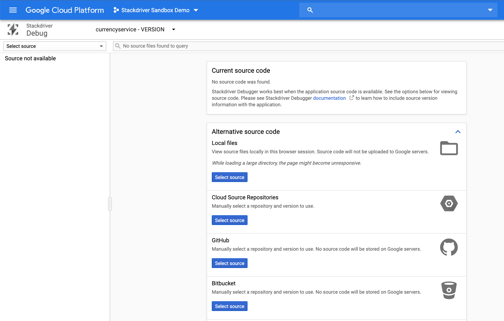

As you can see, Debugger requires access to source code to function.  For this exercise, you'll download the code locally and link it to Debugger.

##### Download source code

In **Cloud Shell**, issue these **commands** to download a release of the Sandbox source code and extract the archive:

```bash
cd ~
wget https://github.com/GoogleCloudPlatform/cloud-ops-sandbox/archive/next19.tar.gz
tar -xvf next19.tar.gz
cd cloud-ops-sandbox-next19
```

##### Create and configure source repository

To create a Cloud Source Repository for the source code and to configure Git access, issue these commands in Cloud Shell:

```bash
gcloud source repos create google-source-captures
git config --global user.email "user@domain.tld" # substitute with your email
git config --global user.name "first last"       # substitute with your name
```

##### Upload source code to Debugger

In the Debugger home page, **copy** the command (_don't click the button!_) in the "Upload a source code capture to Google servers" box, but **don't include the `LOCAL_PATH` variable**. (You will replace this with another value before executing the command.)

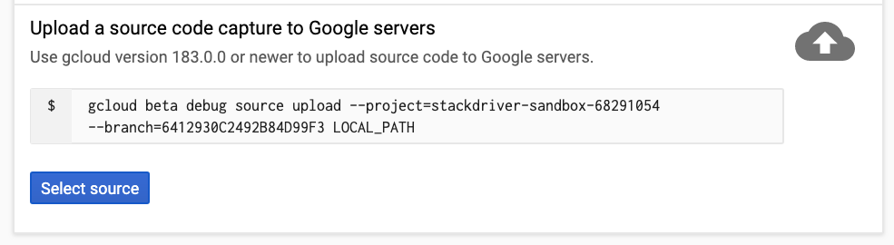

Paste the command into your Cloud Shell prompt and add a space and a period:

```bash
gcloud beta debug source upload --project=cloud-ops-sandbox-68291054 --branch=6412930C2492B84D99F3 .
```

Enter _RETURN_ to execute the command.

In the Debugger home page, click the **Select Source** button under "Upload a source code capture" option, which will then open the source code:

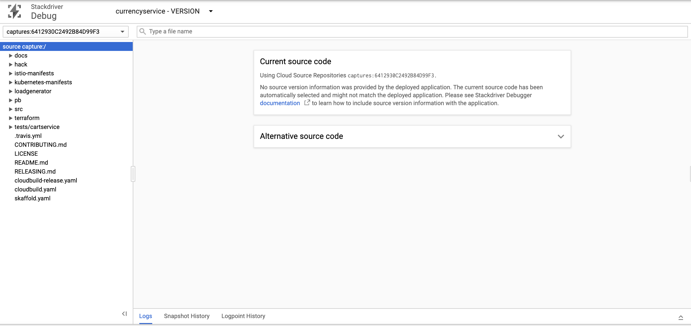

You are now ready to debug your code!

##### Create a snapshot

Start by using the Snapshot functionality to understand the state of your variables.  In the Source capture tree, open the **`server.js`** file under **src** > **currencyservice.** 

Next, click on **line 121** to create a snapshot. in a few moments, you should see a snapshot be created, and you can view the values of all variables at that point on the right side of the screen:

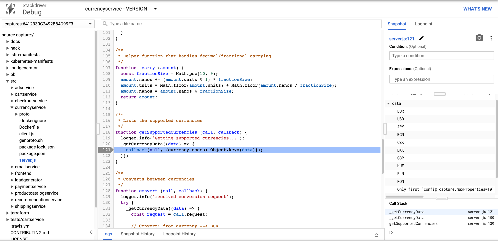


##### Create a logpoint

Switch to the **Logpoint** tab on the right side. To create the logpoint:

1. Again, click on **line 121** of **`server.js`** to position the logpoint.
1. In the **Message** field, type "testing logpoint" to set the message that will be logged.
1. Click the **Add** button. 

To see all messages that are being generated in Cloud Logging from your logpoint, click the **Logs** tab in the middle of the UI. This brings up an embedded viewer for the logs:

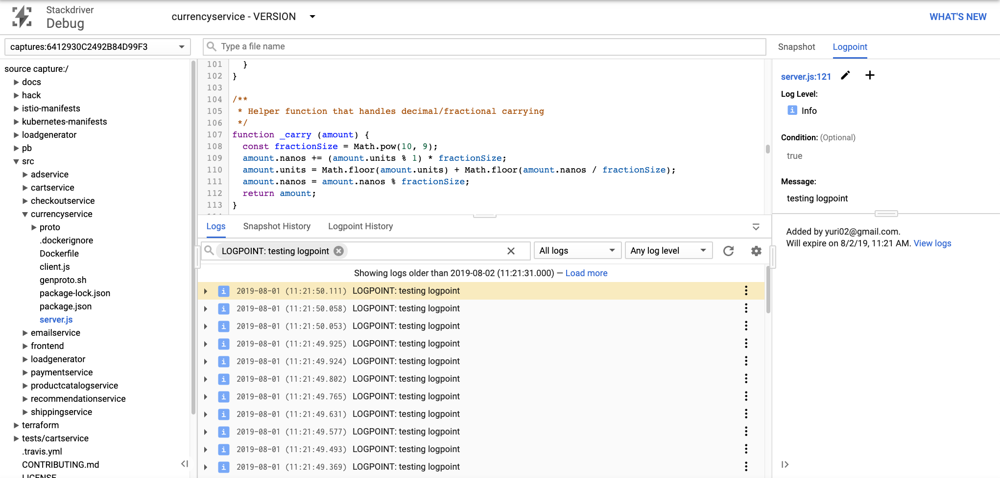

## The Cloud observability products: Monitoring, Logging, and Error Reporting

### Cloud Monitoring

#### Monitoring Overview

Cloud Monitoring ([documentation](https://cloud.google.com/monitoring/docs/)) is the go-to place to grasp real-time trends of the system based on SLI/SLO. SRE team and application development team (and even business organization team) can collaborate to set up charts on the monitoring dashboard using metrics sent from the resources and the applications. 

#### Using Monitoring

To get to Cloud Monitoring from the GCP console, select **Monitoring** on the navigation panel. By default, you reach an overview page:


There are many pre-built monitoring pages. For example, the GKE Cluster Details page (select **Monitoring > Dashboards > Kubernetes Engine > Infrastructure**) brings up a page that provides information about the Sandbox cluster: 

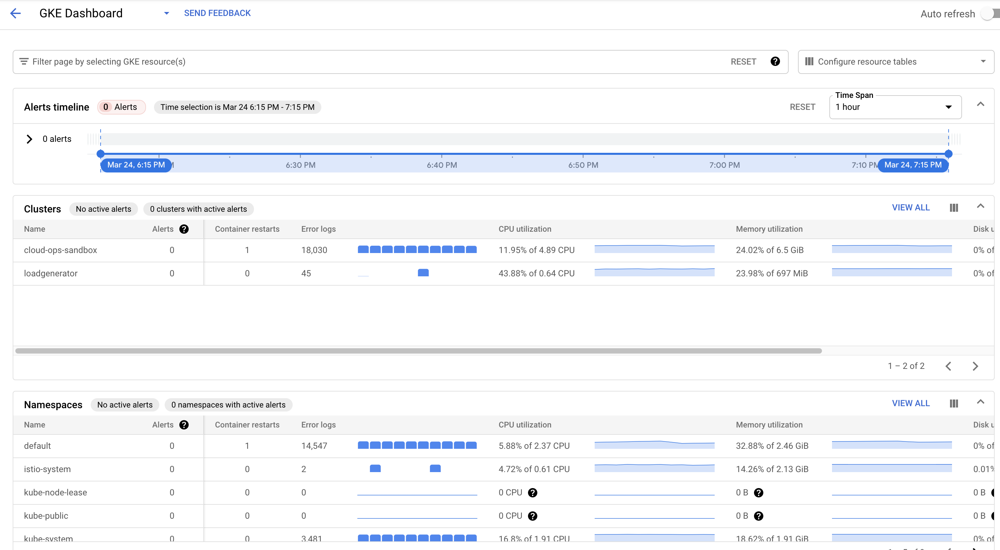

You can also use the Monitoring console to create alerts and uptime checks, and to create dashboards that chart metrics you are interested in.  For example, Metrics Explorer lets you select a specific metric, configure it for charting, and then save the chart. Select **Monitoring > Metrics Explorer** from the navigation panel to bring it up.

The following chart shows the client-side RPC calls that did not result in an OK status:

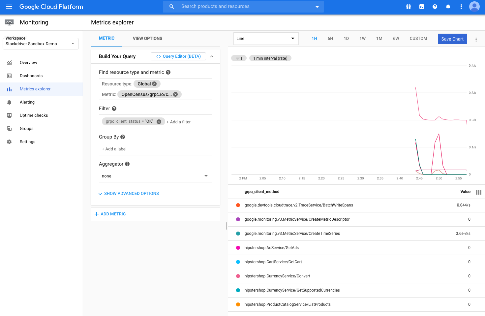

This chart uses the  metric type `custom.googleapis.com/opencensus/ grpc.io/client/completed_rpcs` (display name: "OpenCensus/grpc.io/client/ completed_rpcs" ), and filters on the  `grpc_client_status` label to keep only those time series  where the label's value is something other than "OK".

##### Monitoring and logs-based metrics

Cloud Logging lets you define metrics based on information in structured logs. For example, you can count the number of log entries containing a particular message or extract latency info from log records. These "logs-based metrics" can then be charted with Cloud Monitoring. For details, see ["Using logs-based metrics"](https://cloud.google.com/logging/docs/logs-based-metrics/).

Cloud Logging defines some logs-based metrics, but you can also create your own. To see the available metrics, select **Logging> Logs-based metrics** from the navigation panel. You see a summary of the system-provided and user-defined logs-based metrics:

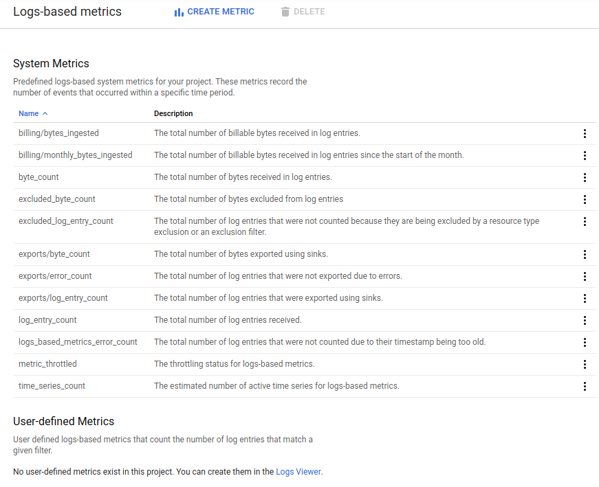

All system-defined logs-based metrics are counters.  User-defined logs-based metrics can be either counter or distribution metrics.

##### Creating a logs-based metric

To create a logs-based metric, click the **Create Metric** button at the top of the **Logs-based metrics** page or the Logs Viewer. This takes you to the Logs Viewer if needed, and also brings up the Metric Editor panel.

Creating a logs-based metric involves two general steps:

1. Identifying the set of log entries you want to use as the source of data for your entry by using the Logs Viewer. Using the Logs Viewer is briefly described in the **Cloud Logging** section of this document.
2. Describing the metric data to extract from these log entries by using the Metric Editor.

This example creates a logs-based metric that counts the number of times a user (user ID, actually) adds an item to the HipsterShop cart.  (This is an admittedly trivial example, though it could be extended. For example, from this same set of records, you can extract the user ID, item, and quantity added.)

First, create a logs query that finds the relevant set of log entries:

1. For the resource type, select **Kubernetes Container > cloud-ops-sandbox > default > server**
2. In the box with default text "Filter by label or text search", enter "AddItemAsync" (the method used to add an item to the cart), and hit return.

The Logs Viewer display shows the resulting entries:

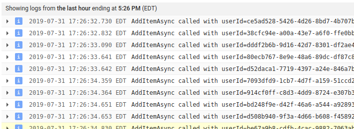

Second, describe the new metric to be based on the logs query. This will be a counter metric. Enter a name and description and click **Create Metric**:

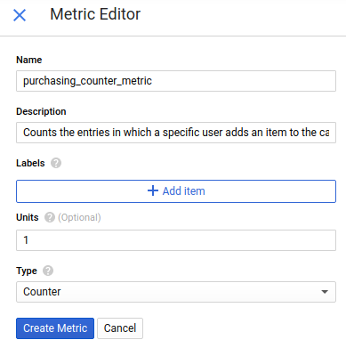

It takes a few minutes for metric data to be collected, but once the metric collection has begun, you can chart this metric just like any other.

To chart this metric using Metrics Explorer, select **Monitoring** from the GCP console, and on the Monitoring console, select **Resources > Metrics** Explorer.

Search for the metric type using the name you gave it ("purchasing_counter_metric", in this example):

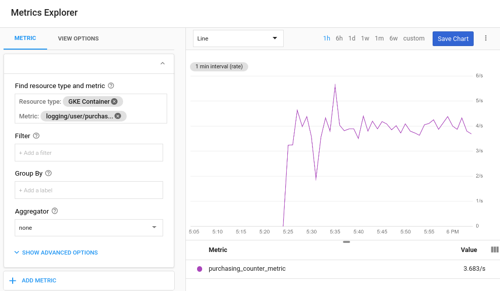

### Cloud Logging

#### Logging Overview

On detecting unusual symptoms in the charts, operators can look into Cloud Logging ([documentation](https://cloud.google.com/logging/docs/)) to find clues of it in the log messages. Filtering lets you identify relevant logs, and logs can be exported from Cloud Logging to "sinks" for long-term storage.

#### Using Logging

You can access Cloud Logging by selecting **Logging** from the GCP navigation menu. This brings up the Logs Viewer interface:

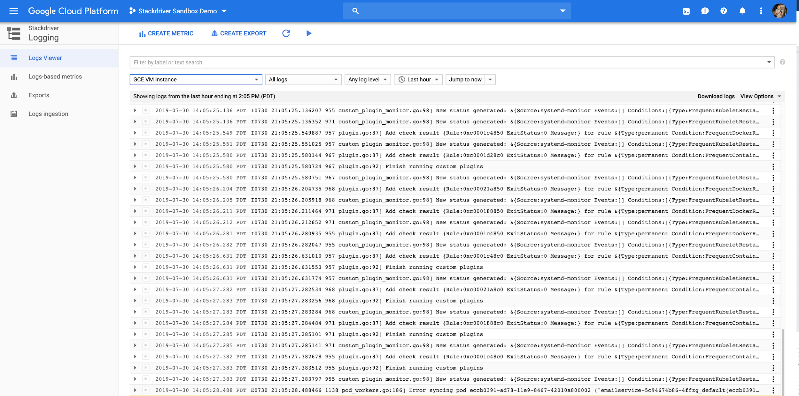

The Logs Viewer allows you to view logs emitted by resources in the project using search filters provided.  The Logs Viewer lets you select standard filters from pulldown menus. 

##### An example: server logs

To view all container logs emitted by pods running in the default namespace, use the Resources and Logs filter fields (these default to **Audited Resources** and **All logs**):

1. For the resource type, select **GKE Container -> cloud-ops-sandbox -> default**
2. For the log type,  select **server**

The Logs Viewer now displays  the logs generated by pods running in the default namespace:

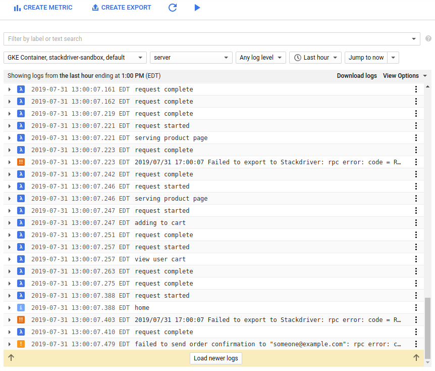

##### Another example: audit logs

To see logs for  all audited actions that took place in the project during the specified time interval:

1. For the resource type, select **Audited Resources > All services**
1. For the log type, select** All logs**
1. For the time interval, you might have to experiment, depending on how long your project has been up.

The Logs Viewer now shows all audited actions that took place in the project during the specified time interval:

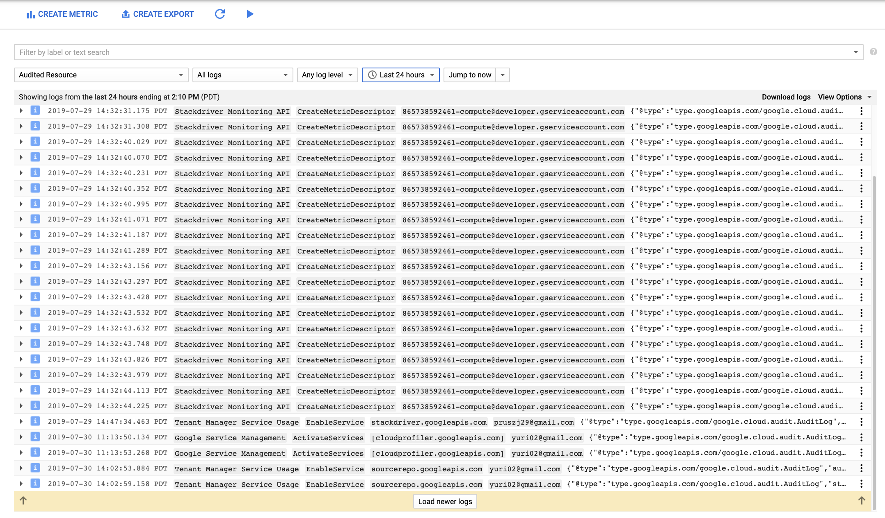

##### Exporting logs

Audit logs contain the records of who did what. For long-term retention of these records, the recommended practice is to create exports for audit logs. You can do that by clicking on **Create Sink**:

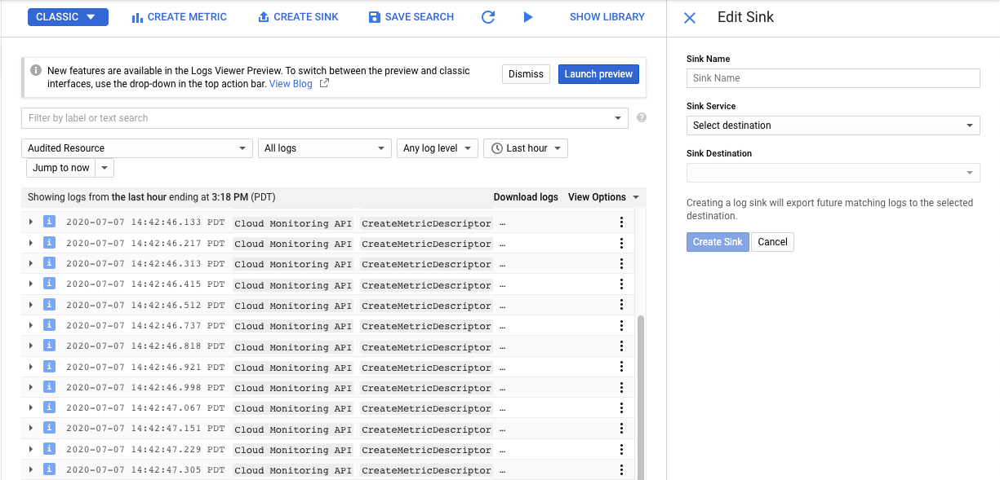

Give your sink a name, and select the service  and destination to which you will export your logs. We recommend using a less expensive class of storage for exported audit logs, since they are not likely to be accessed frequently. For this example, create an export for audit logs to Google Cloud Storage.

Click **Create Sink**. Then follow the prompts to create a new storage bucket and export logs there:

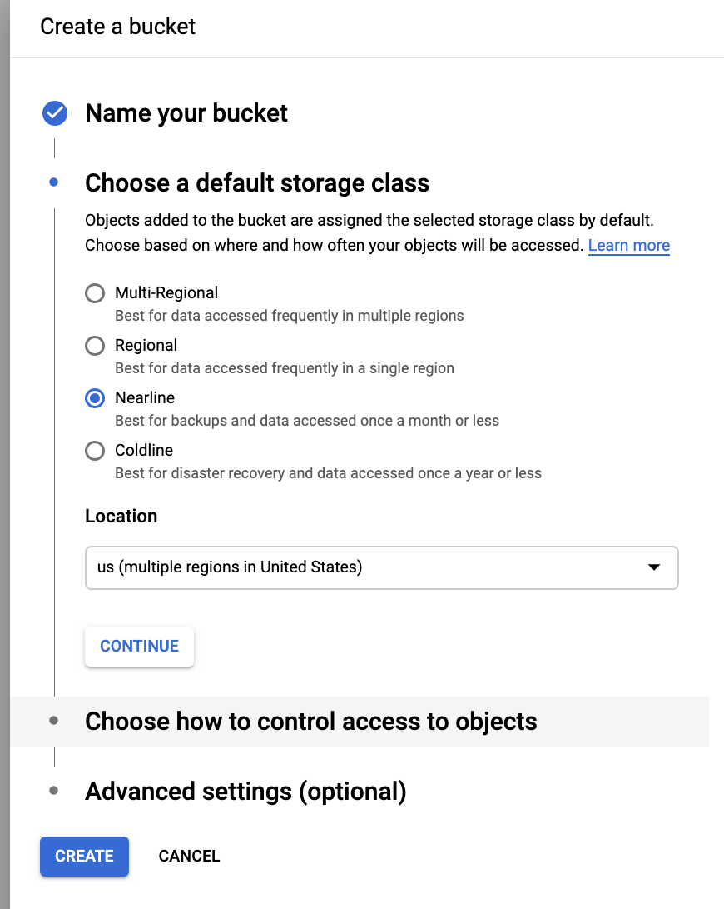

### Cloud Error Reporting

#### Error Reporting Overview

Cloud Error Reporting ([documentation](https://cloud.google.com/error-reporting/docs/)) automatically groups errors depending on the stack trace message patterns and shows the frequency of each error groups. The error groups are generated automatically, based on stack traces.

On opening an error group report, operators can access to the exact line in the application code where the error occurred and reason about the cause by navigating to the line of the source code on Google Cloud Source Repository. 

#### Using Error Reporting

You can access Error Reporting by selecting **Error Reporting** from the GCP navigation menu:

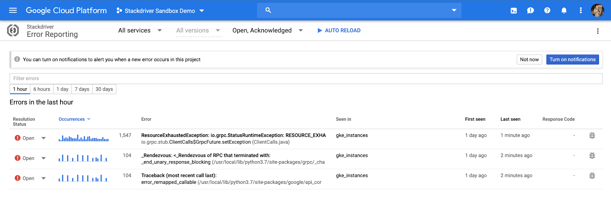

> **Note:** Error Reporting can also let you know when new errors are received; see ["Notifications for Error Reporting"](https://cloud.google.com/error-reporting/docs/notifications) for details.

To get started, select any open error by clicking on the error in the **Error** field:

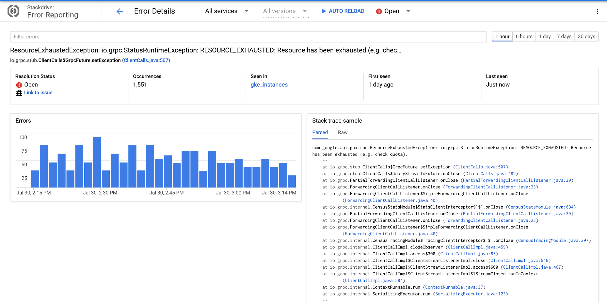

The **Error Details** screen shows you when the error has been occurring in the timeline and provides the stack trace that was captured with the error.  **Scroll down** to see samples of the error:

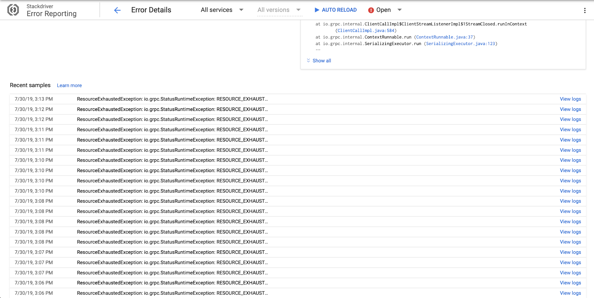

Click **View Logs** for one of the samples to see the log messages that match this particular error:

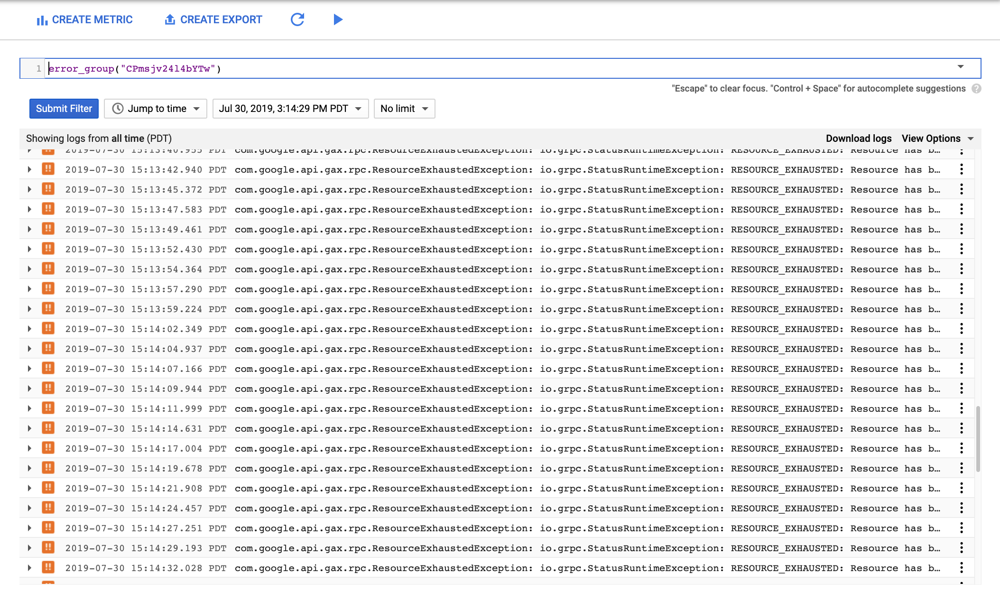

You can expand any of the messages that matches the filter to see the full stack trace:

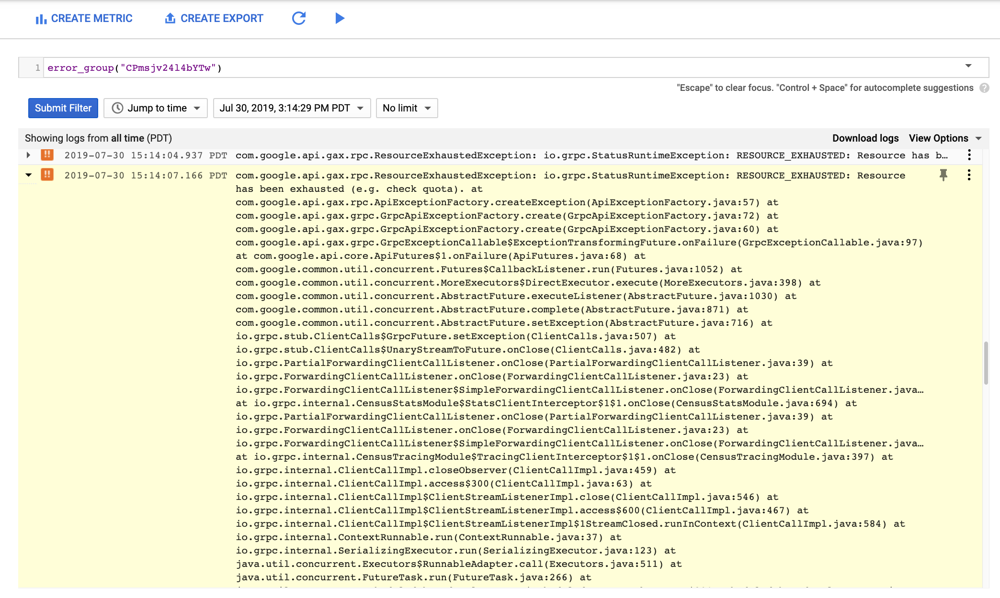

# Destroying your cluster

Once you have finished exploring the Cloud Operations Sandbox project, don't forget to destroy it to avoid incurring additional billing.

Destroy your Sandbox project by opening the Cloud Shell and running sandboxctl destroy:
```
$ sandboxctl destroy
```

This script destroys the current Cloud Operations Sandbox project. If `sandboxctl create` were run again, a Cloud Operations Sandbox project with a new project id would be created.

# OpenCensus to become OpenTelemetry

The Cloud Operations Sandbox project uses the [OpenCensus libraries](https://opencensus.io/) for collection of traces and metrics. OpenCensus provides a set of open-source libraries for a variety of languages, and the trace/metric data collected with these libraries can be exported to a variety of backends, including Cloud Monitoring.

For the next major release, OpenCensus is combining with the [OpenTracing project](https://opentracing.io/) to create a single solution, called [OpenTelemetry](https://opentelemetry.io/). OpenTelemetry will support basic context propagation, distributed traces, metrics, and other signals in the future, superseding both OpenCensus and OpenTracing.
