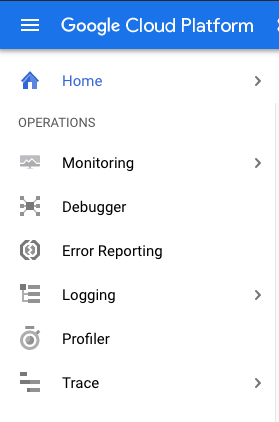
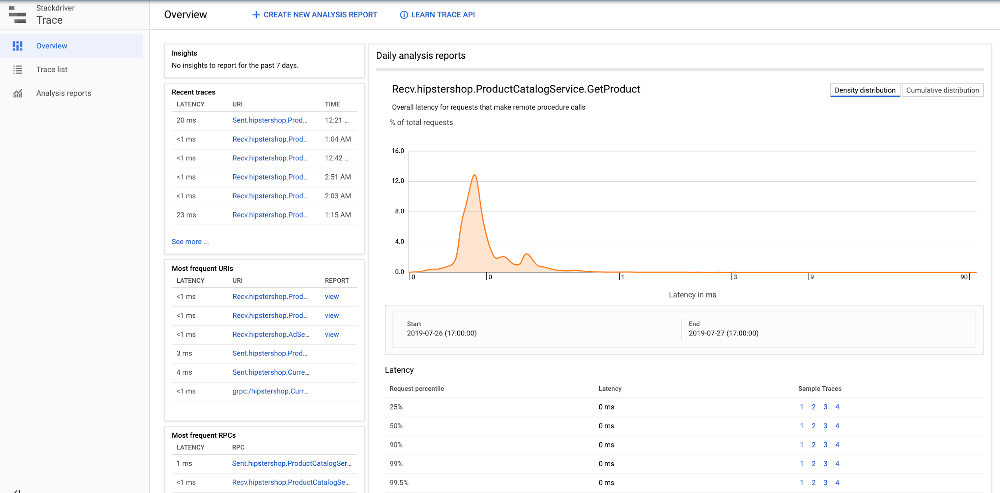
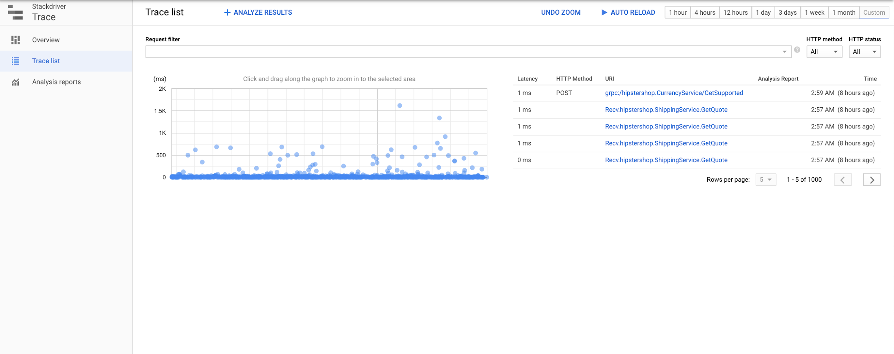
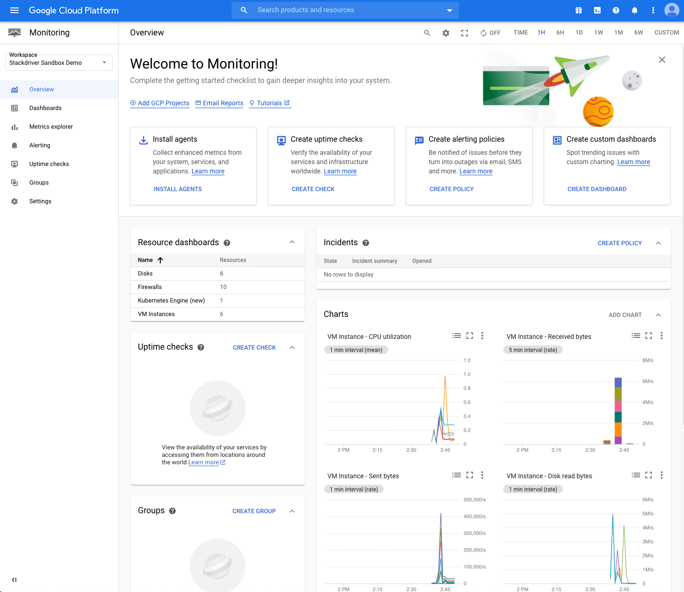
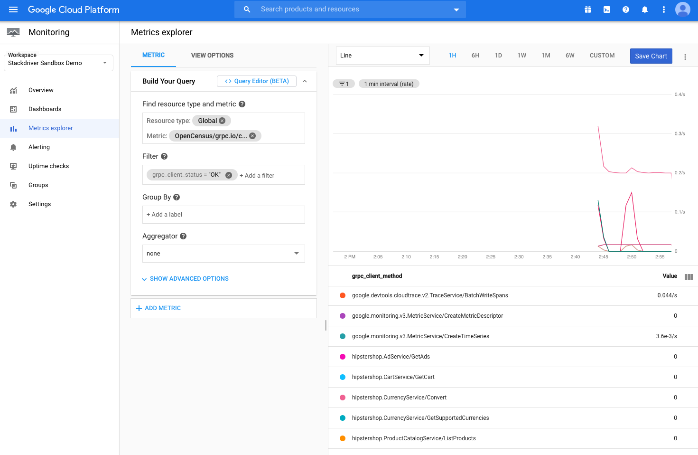
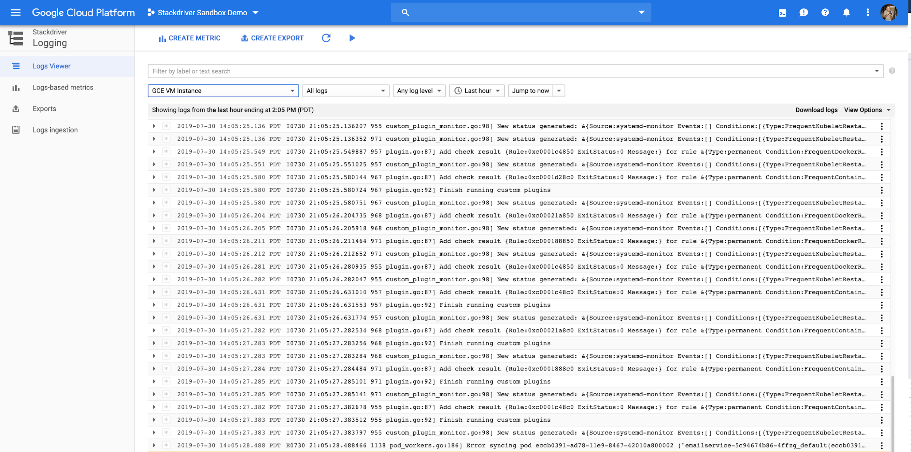

# Learn about Cloud Operations services and tools that Sandbox uses

Cloud Operations suite of services provides products for both developers and
DevOps engineers and can work across multiple cloud platforms. It provides
means for engineers to implement Application Performance Management (or APM) by
observing and detecting reliability problems as well as by investigating them
at runtime. The Cloud Operations suite provides the following products for APM:

* [Cloud Logging](https://console.cloud.google.com/logging)
* [Cloud Trace](https://console.cloud.google.com/traces)
* [Cloud Monitoring](https://console.cloud.google.com/monitoring)
* [Cloud Profiler](https://console.cloud.google.com/profiler)

You can find the Cloud Operations products in the navigation panel on the GCP Console:



## Cloud Trace

Cloud Trace (see [documentation](https://cloud.google.com/trace/docs/)) enables
developers to see distributed traces that visually expose latency bottleneck in
distributed transactions of the application. Developers have to instrument
tracing capabilities into application code. Trace metadata can including additional
information about environment and can also correlate with application logs
ingested to Cloud Logging. Cloud Trace GUI can show relevant log events within the
trace timelines.

Online Boutique uses [OpenTelemetry SDK][otel-doc] to instrument its microservices
(written in 5 languages) to capture tracing information.

### Using Traces

To bring up Cloud Trace, type `Trace` in the Search area of the Google Cloud
Console or select `Trace` in the Console's navigation panel.
This takes you to the Trace **Overview** page, where you can see all traces
generated by Online Boutique microservices:



Select `Trace List` in the navigation panel to explore all traces for a particular
time period:



Selecting any trace on the diagram shows a detailed view and breakdown of the
traced transaction into subsequent calls.

Finally, select `Analysis Reports` in the navigation menu to see a list of reports
that were generated or to create a new report for a particular type of traces.

Note that if you have just launched Sandbox, you may not see many traces or any reports.

## Cloud Monitoring

Cloud Monitoring ([documentation][monitoring]) is the go-to place to grasp real-time
trends of the system based on various metrics.
Cloud Monitoring collects platform metrics as well as application metrics.
You will be able to explore metrics reported by control and data planes of GKE, Anthos
Service Mesh (ASM) and application metrics generated by Online Boutique.
SREs and SWEs team can collaborate to set up charts on the monitoring dashboard using
metrics sent from the resources and the applications.

### Using Monitoring

Same as with Trace you can get to Cloud Monitoring in Google Cloud Console by searching
for `Monitoring` or selecting `Monitoring` in the navigation panel.
You will get to the Overview page:



It shows many pre-built charts and widgets like GKE cluster details.

You can explore metrics by selecting `Metric Explorer` in the navigation panel and
filtering metrics by metric type and additional parameters that depend on the kind
of the metric. The following screenshot shows the custom metric of the type
`custom.googleapis.com/opencensus/ grpc.io/client/completed_rpcs` (displayed as "OpenCensus
//grpc.io/client/ completed_rpcs") and filtered on `grpc_client_status` label to
keep only those time series where the label's value is not "OK".



See more about metric filters in the [documentation][metric-filter].

#### Monitoring and logs-based metrics

Cloud Logging allows to generate metrics from logs. They are referenced as log-based
metrics. Sandbox creates one log-based metric for Online Boutique.
In Metric Explorer search for `checkoutservice_log_metric` to see a counter metric
that keeps track about number of ordered products which can be further filtered by
the product name or product id (using labels).
You can see all log-based metrics if you open [Log-based Metrics][lbm] in Cloud Console.

See more about log-based metrics in the [documentation][lbm-doc].

## SLO Monitoring

[Service Level Objectives][slo] (SLOs) are a core tool in the Cloud Monitoring
service. You can navigate to it by selecting `Services` in the navigation panel of
[Cloud Monitoring][mon] in Cloud Console.
This tool gives you a consice and low-noise signal about your service reliability
following best practices of [SRE] from Google.

Cloud Monitoring identifies potential service or _candidates_ for SLO tracking
by looking at services deployed on App Engine, GKE and Cloud Run.
You can select then define a service to be used for SLO monitoring among them or
to use a [custom-defined service][slo-custom-svc].
Cloud Monitoring applies [auto-discovery mechanism][auto-discovery] to automatically
define microservices built using the following development frameworks:

* **App Engine**: App Engine has a strong notion of microservice, called an App
Engine service (and formerly a module). Each service is distinguished by its own
app.yaml configuration file.
* **Anthos Service Mesh** (ASM): Cloud Monitoring supports service meshes built
atop a single GKE cluster. In this configuration, an Anthos Service Mesh service
corresponds directly to a GKE service. All Anthos Service Mesh services, both
user-managed and system-managed, are automatically detected.

For these services you can define service-level objectives (SLOs) using standard
availability and latency metrics that the services provide implicitly.
For other candidate services (e.g. Kubernetes services) and custom services you
will have to define which metrics should be used and, possibly, implement the
metric collection and ingestion.

Cloud Ops Sandbox configures availability and latency SLOs for all Online
Boutique services when launched **with** ASM. It uses the standard availability
configuration with a customized latency SLO that is defined using the Istio
generated metric `istio.io/service/server/response_latencies` as following:

> **90**% of all _valid_ responses are returned within 1000(ms) during last 30 days

The request latency for the _service_name_ service is acquired from metrics
using the following filter:

```terminal
metric.type="istio.io/service/server/response_latencies"
AND resource.type="`k8s_container`"
AND resource.label."`cluster_name`"="`cloud-ops-sandbox`"
AND metric.label."`response_code`"="`200`"
AND metadata.user_labels."`app`"="<_service_name_>"
```

> **Note**
> The name of the cluster can be different if you customized it at launch
(using `--cluster-name` parameter).

### SLO Alerts

You can create alerts to notify you when SLO is broken or when Error Budget
[burning rate][br] is higher than expected.

Cloud Ops Sandbox defines SLO alerts based on the slow-burn threshold of
2x the baseline with a 2-minute lookback period. A common practice for the
slow-burn alerts to use hour resolution for lookback periods. Sandbox uses
minute resolution to demonstrate results faster.

The alerts are configured to send notification to non-existing email.
If you want to see how the alert notification looks like, you can edit the
email address in the alert notification channel by:

1. Opening [Notification Channels][notification] in Cloud Console
1. Finding the list of **Email** channels
1. Finding the channel with Email that reads `devops@acme.com`
1. And [editing][notificaiton-edit] the email on the channel

## Cloud Logging

Operators can look at [logs] in [Cloud
Logging][logs-doc] to find clues explaining any
anomalies in the metrics charts.

### Using Logging

You can access Cloud Logging by selecting **Logging** from the GCP navigation
menu. This brings up the Logs Viewer interface:



The Logs Viewer allows you to view logs emitted by resources in the project
using search filters provided.
The Logs Viewer lets you select standard filters from pulldown menus.

#### An example: Online Boutique service logs

All Online Boutique workload in GKE is deployed to the `default` namespace.
To view all logs emited by the Online Boutique services do the following:

1. Open `Log Explorer` in the navigation panel
1. In the panel on the left from the logs set up filter parameters

   1. For RESOURCE TYPE select `Kubernetes Container`
   1. Skip other fields until you find CONTAINER NAME and select
   `cloud-ops-sandbox`. Mind that the name of the cluster can be different if
   you customized it at launch (using `--cluster-name` parameter).
   1. Skip to NAMESPACE NAME and select `default`.
   1. Skip to CONTAINER NAME and select `server`.

   The same result can be achieved by copy/pasting the following filters in
   the Query area:

   ```terminal
   resource.type="k8s_container"
   resource.labels.cluster_name="cloud-ops-sandbox"
   resource.labels.namespace_name="default"
   resource.labels.container_name="server"
   ```

1. Press "Run Query" button

The Logs Explorer will display all logs generated by all Online Boutique services.

[otel-doc]: https://opentelemetry.io/docs/
[monitoring]: https://cloud.google.com/monitoring/docs/
[metric-filter]: https://cloud.google.com/monitoring/api/v3/filters
[lbm]: https://console.cloud.google.com/logs/metrics
[lbm-doc]: https://cloud.google.com/logging/docs/logs-based-metrics/
[logs]: https://console.cloud.google.com/logs
[logs-doc]: (https://cloud.google.com/logging/docs/)
[slo]: https://cloud.google.com/service-mesh/docs/observability/slo-overview
[mon]: https://console.cloud.google.com/monitoring
[sre]: https://sre.google/
[slo-custom-svc]: https://cloud.google.com/stackdriver/docs/solutions/slo-monitoring/ui/define-svc#define-custom-svc
[auto-discovery]: https://cloud.google.com/stackdriver/docs/solutions/slo-monitoring/microservices#auto-svcs
[br]: https://cloud.google.com/stackdriver/docs/solutions/slo-monitoring/alerting-on-budget-burn-rate
[notification]: https://pantheon.corp.google.com/monitoring/alerting/notifications
[notificaiton-edit]: https://cloud.google.com/monitoring/support/notification-options#edit-delete-channel
