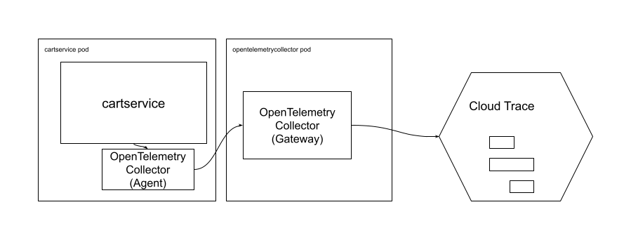

# Cart Service

The Cart Service is a microservice written in C# and
the [.NET 5](https://docs.microsoft.com/en-us/dotnet/core/dotnet-five) framework. It manages
shopping cart state for users of the Hipster Shop.

## Overview

The Cart Service communicates over gRPC and stores cart information in a Redis database. It exposes
a GET endpoint to retrieve a cart for a given user, as well as POST endpoints for adding items to
carts and emptying carts.

## OpenTelemetry Configuration

The Cart Services uses [OpenTelemetry](https://opentelemetry.io/) to collect trace information from
the microservice and forward it to [Cloud Trace](https://cloud.google.com/trace). Specifically, it
forwards trace information to an instance of
the [OpenTelemetry Collector](https://github.com/open-telemetry/opentelemetry-collector) which is
running as a sidecar container in the same pod. This lightweight process (often referred to as
an [agent](https://opentelemetry.io/docs/collector/getting-started/)) then forwards the trace
information to a separate deployment of the OpenTelemetryCollector which is able to batch traces
from multiple microservices and forward them to Cloud Trace. This collector runs the same binary but
can be configured to use more memory and computational resources. This standalone collector is
referred to as a [gateway](https://opentelemetry.io/docs/collector/getting-started/).

